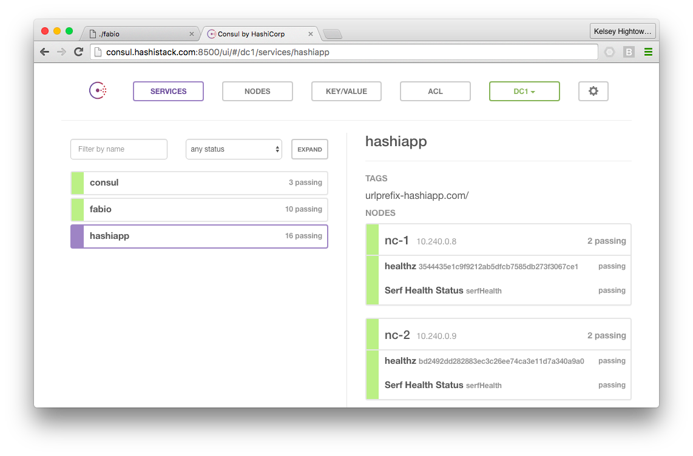
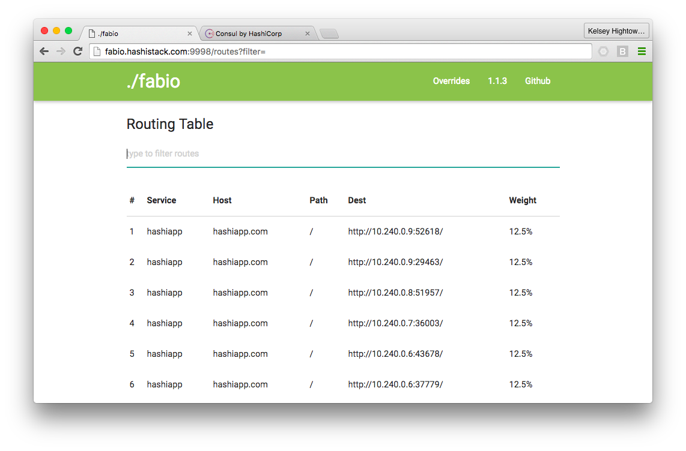

# HashiConf EU 2016

## Provision MySQL

```
gcloud sql instances create hashiapp \
  --tier db-n1-standard-1 \
  --activation-policy ALWAYS \
  --authorized-networks 0.0.0.0/0
```

```
gcloud sql instances set-root-password hashiapp \
  --password <password>
```

```
gcloud sql instances describe hashiapp
```

```
mysql -u root -h <database-ip> -p
Enter password: 
```

```
mysql> CREATE DATABASE hashiapp;
```

## Bootstrap a Nomad Cluster

This step will also install Nomad, Consul, and Vault.

```
gcloud compute instances create ns-1 ns-2 ns-3 \
  --image-project ubuntu-os-cloud \
  --image ubuntu-1604-xenial-v20160516a \
  --boot-disk-size 200GB \
  --machine-type n1-standard-2 \
  --can-ip-forward \
  --metadata-from-file startup-script=server-install.sh
```

```
gcloud compute ssh ns-1
```

```
git clone https://github.com/kelseyhightower/hashiconf-eu-2016.git
```
```
cd hashiconf-eu-2016
```


### Provision the Nomad Cluster

```
nomad server-join ns-2 ns-3
```

```
nomad status
```

### Provision the Consul Cluster

```
gcloud compute ssh ns-1
```

```
consul join ns-2 ns-3
```

```
consul members
```
```
Node  Address          Status  Type    Build  Protocol  DC
ns-1  10.240.0.4:8301  alive   server  0.6.4  2         dc1
ns-2  10.240.0.3:8301  alive   server  0.6.4  2         dc1
ns-3  10.240.0.2:8301  alive   server  0.6.4  2         dc1
```

### Provison Vault

```
export VAULT_ADDR=http://ns-1:8200
```

```
vault init
```

#### Unseal Vault

```
vault unseal
```
```
vault status
```
```
Sealed: false
Key Shares: 5
Key Threshold: 3
Unseal Progress: 0

High-Availability Enabled: true
	Mode: active
	Leader: http://10.240.0.2:8200
```

#### Create the Hashiapp Policy and Token

```
vault auth <root-token>
```

```
vault policy-write hashiapp vault/hashiapp-policy.hcl
```

```
vault token-create \
  -policy="hashiapp" \
  -display-name="hashiapp"
```

```
sed -i "s/HASHIAPP_TOKEN/<hashiapp-token>/" jobs/hashiapp.nomad 
```

#### Create the Hashiapp Secret

```
vault write secret/hashiapp jwtsecret=secret
```

#### Configure the MySQL Secret Backend

```
vault mount mysql
```

```
vault write mysql/config/connection \
> connection_url="USERNAME:PASSWORD@tcp(HOST:PORT)/"
```

```
vault write mysql/roles/hashiapp \
  sql="CREATE USER '{{name}}'@'%' IDENTIFIED BY '{{password}}';GRANT ALL PRIVILEGES ON hashiapp.* TO '{{name}}'@'%';"
```

```
sed -i "s/CLOUD_SQL/<cloud-sql-ip>/" jobs/hashiapp.nomad
```

### Bootstrap Nomad Worker Nodes

```
gcloud compute instances create nc-1 nc-2 nc-3 nc-4 nc-5 \
  --image-project ubuntu-os-cloud \
  --image ubuntu-1604-xenial-v20160516a \
  --boot-disk-size 200GB \
  --machine-type n1-standard-2 \
  --can-ip-forward \
  --metadata-from-file startup-script=client-install.sh
```

```
nomad node-status
```
```
ID        DC   Name  Class   Drain  Status
ec906293  dc1  nc-5  <none>  false  ready
eb73ef71  dc1  nc-2  <none>  false  ready
a2328a47  dc1  nc-1  <none>  false  ready
537709ec  dc1  nc-3  <none>  false  ready
4e0a6bcb  dc1  nc-4  <none>  false  ready
```

## Service Discovery with Consul



```
gcloud compute ssh ns-1
```

```
nomad run jobs/consul.nomad
```

```
nomad status consul
```

```
consul join nc-1 nc-2 nc-3 nc-4 nc-5
```

```
consul members
```
```
Node  Address          Status  Type    Build  Protocol  DC
nc-1  10.240.0.8:8301  alive   client  0.6.4  2         dc1
nc-2  10.240.0.9:8301  alive   client  0.6.4  2         dc1
nc-3  10.240.0.6:8301  alive   client  0.6.4  2         dc1
nc-4  10.240.0.7:8301  alive   client  0.6.4  2         dc1
nc-5  10.240.0.5:8301  alive   client  0.6.4  2         dc1
ns-1  10.240.0.4:8301  alive   server  0.6.4  2         dc1
ns-2  10.240.0.3:8301  alive   server  0.6.4  2         dc1
ns-3  10.240.0.2:8301  alive   server  0.6.4  2         dc1
```

## Load Balancing with Fabio



```
nomad run jobs/fabio.nomad
```

```
nomad status fabio
```

### Create L3 LoadBalancer

```
gcloud compute addresses create hashistack
```

```
gcloud compute http-health-checks create hashistack \
  --port 9998 \
  --request-path "/health"
```

```
gcloud compute target-pools create hashistack \
  --health-check hashistack
```

```
gcloud compute target-pools add-instances hashistack \
  --instances nc-1,nc-2,nc-3,nc-4,nc-5
```

```
gcloud compute addresses list
```

```
gcloud compute forwarding-rules create hashistack \
  --port-range 9998-9999 \
  --address STATIC_EXTERNAL_IP \
  --target-pool hashistack
```

```
gcloud compute firewall-rules create fabio \
  --allow tcp:9998-9999 \
  --source-range 0.0.0.0/0
```

## Hashiapp Job

Submit the hashiapp service job.

```
nomad run jobs/hashiapp.nomad
```

```
nomad status hashiapp
```

### Viewing Logs

```
nomad fs -job hashiapp alloc/logs/hashiapp.stderr.0
nomad fs -job hashiapp alloc/logs/hashiapp.stdout.0
```

### Send Traffic

```
curl -H "Host: hashiapp.com" http://<loadbalancer-ip>:9999/version
```
